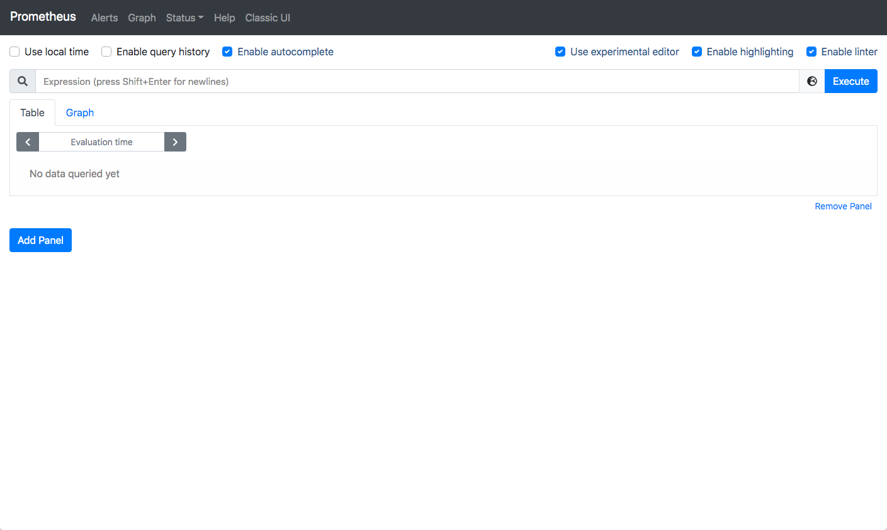
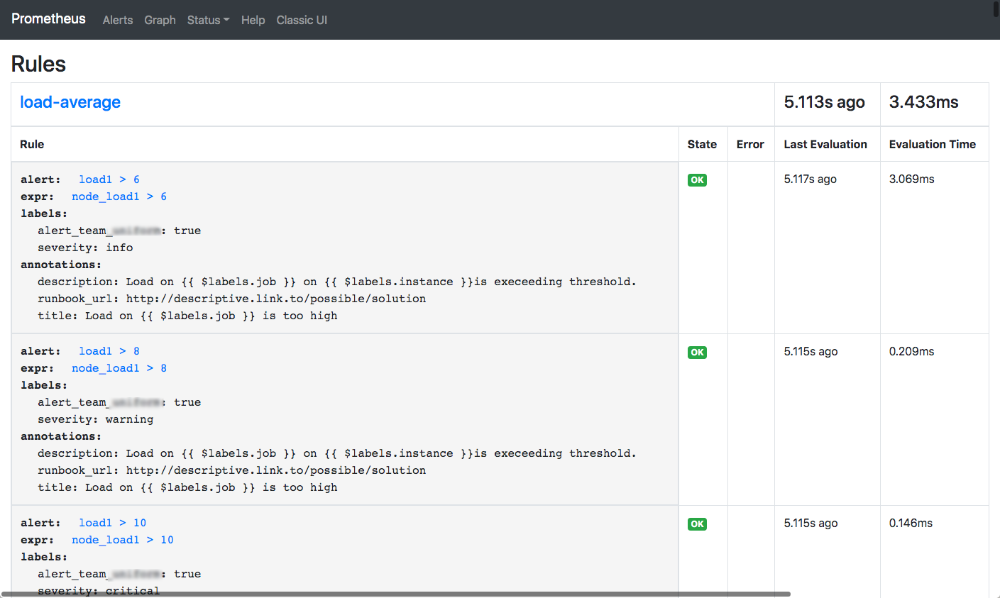
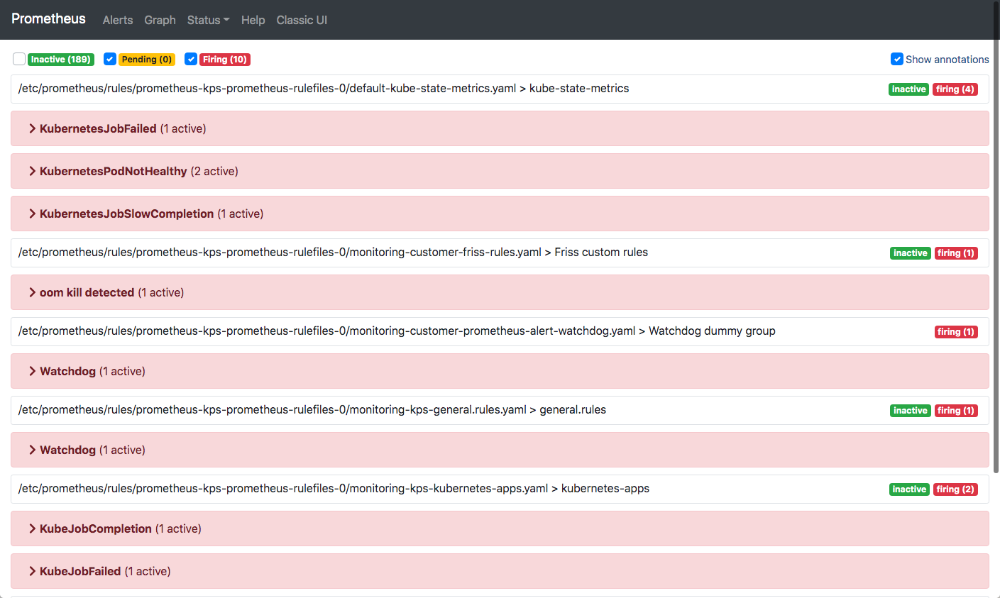
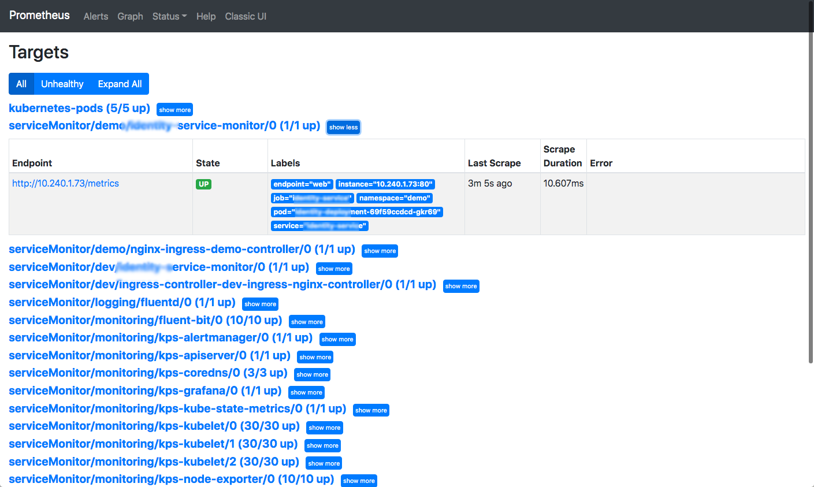

# workshop Prometheus and friends

Monitoring and alerting are important when running software inside a cluster. This has to be done from the inside to be able to detect pod failures reliably. After all, Kubernetes does a great job of masking container restart problems for the outside world to mention one thing that can go wrong.

Prometheus is excellent at monitoring from within the cluster and to detect these events.
Besides detecting these events Prometheus also does a great job at 'scraping' pods for operational metrics about application performance and more.

In fact Prometheus will consume almost anything you feed it as long as it is in the proper format which is described here: <https://prometheus.io/docs/instrumenting/writing_exporters/>.

Any information that is 'exported' and 'scraped' is stored in a TSDB where it can be queried.

A popular tool for quering this information is Grafana. Grafana can create nice dashboards to visualize this information.

The information is also processed by Prometheus itself using a query language known als PromQL. This is a very powerfull way to detect anomolies.
Prometheus uses PromQL to evaluate rules and creates an alert if an anomolie is detected.

Often these alerts are passed on to 'Alertmanager' for further processing. Alertmanager can send notifications via many backends to create the awareness.

## Prequisites

For this workshop you need access to a Kubernetes cluster which has Prometheus and Alertmanager running. Also the Prometheus Operator has to be installed. This Operator allows us to configure rules and alerts with Kubernetes Manifest files.

## Assumptions

There are assumptions about the deployment. If your deployment is done different please adjust certain settings.

The assumptions are that following settings apply:

| Name | Namespace | Kind | Port |
| --- | --- | --- | --- |
| alertmanager-operated | monitoring | service | 9093 |
| prometheus-operated | monitoring | service | 9090 |

## Accessing the Applications

In order to access Prometheus and Alertmanager we'll use `kubectl`. Prometheus and friends are not exposed to the outside world!

Open up two terminals and enter the following commands, each in its own terminal:

```bash
❯ kubectl -n monitoring port-forward service/alertmanager-operated 9093:9093
Forwarding from 127.0.0.1:9093 -> 9093
Forwarding from [::1]:9093 -> 9093
```

```bash
❯ kubectl -n monitoring port-forward service/prometheus-operated 9090:9090
Forwarding from 127.0.0.1:9090 -> 9090
Forwarding from [::1]:9090 -> 9090
```

> Warning: These forwards are not always working reliable. If you loose the connection you have to terminate the port forward by entering Ctl + C and enter the command again.

## Explore Prometheus

If the portforwarding is succesfull you should be able to navigate to <http://localhost:9090>. You'll see the GUI of Prometheus that we're going to explore.

### Graph

Initially it looks like this , we're on the Graph screen.

Here you can enter and test expressions such as `kube_pod_container_status_terminated` and clicl 'Execute'. This will show a table with many entries. More interesting is the expression `kube_pod_container_status_terminated > 0`.

This is one method to filter specific entries. Another method is to filter on labels. Compare the difference between these two: `kube_pod_container_status_terminated` and `kube_pod_container_status_terminated{namespace='pentest'}`.
It is possible to combine these: `kube_pod_container_status_terminated{namespace='pentest'} > 0` or even apply a function: `count(kube_pod_container_status_terminated{namespace='pentest'} > 0)`

### Status -> Rules

Next click on Status and Rules. The next screen is shown: 
This is the screen where you can _see_ the rules that Prometheus uses to generate alerts. The important fields are: `alert:`  which contains a description, `expr:` which contains expressions like we just explored and `labels:`. The labels are added to an alert and can be used by Alertmanager to route alerts to the proper destinations.

You can view the manifest file that contains the configuration of these rules by entering:

```bash
❯ kubectl get prometheusrules.monitoring.coreos.com customer-prometheus-alert-load-average -o yaml
apiVersion: monitoring.coreos.com/v1
kind: PrometheusRule
metadata:
  annotations:
... omitted
  labels:
    app: kube-prometheus-stack
    maintainer: U********m
    release: prometheus-stack
  name: customer-prometheus-alert-load-average
... omitted
spec:
  groups:
  - name: load-average
    rules:
    - alert: load1 > 6
      annotations:
        description: 'Load on {{ $labels.job }} on {{ $labels.instance }}is execeeding
          threshold. '
        runbook_url: http://descriptive.link.to/possible/solution
        title: Load on {{ $labels.job }} is too high
      expr: node_load1 > 6
      labels:
        alert_team_*******: "true"
        severity: info
    - alert: load1 > 8
      annotations:
        description: 'Load on {{ $labels.job }} on {{ $labels.instance }}is execeeding
          threshold. '
        runbook_url: http://descriptive.link.to/possible/solution
        title: Load on {{ $labels.job }} is too high
      expr: node_load1 > 8
      labels:
        alert_team_*******: "true"
        severity: warning
    - alert: load1 > 10
      annotations:
        description: 'Load on {{ $labels.job }} on {{ $labels.instance }}is execeeding
          threshold. '
        runbook_url: http://descriptive.link.to/possible/solution
        title: Load on {{ $labels.job }} is too high
      expr: node_load1 > 10
      labels:
        alert_team_*******: "true"
        severity: critical
```

Likewise by deploying such a manifest file it is possible to add rules.

Within our organisation we have a dedicted pipeline were teams can maintain there own manifest files containing rules and alerts and deploy them. Please check repository 'fc-monitoring'. You'll see some nice examples in here.

### Alerts

The rules we saw earlier could trigger alerts. The are visible on this screen: 

If you inspect an alert you'll see the rule that triggered it and a lot of labels that are associated with the source of the data.

### Status -> Targets

This screen shows all the targets that have been discovered and are being scraped: 

It is hard to relate this information back to deployments. It tells you however which discovery method is being used, in which namespace and more.

Together with Service Discovery it shines a bit of light on how well discovery works.

### Target discovery

Prometheus can discover targets in many different ways. One mechanism that is being used more and more is service discovery.
Prometheus will actively monitor service definitions based on a set of criteria. If endpoints are added or removed from these services this will be noticed by Prometheus. In fact, Prometheus has detected an endpoint and will start scraping it, or remove it if the endpoint is gone.

A sample manifest file can be obtained with the command:

```bash
❯ kubectl get servicemonitors.monitoring.coreos.com -n monitoring asp-dotnet -o yaml
apiVersion: monitoring.coreos.com/v1
kind: ServiceMonitor
metadata:
... omitted
  labels:
    app: asp-dotnet
    release: prometheus-stack
  name: asp-dotnet
  namespace: monitoring
... omitted
spec:
  endpoints:
  - path: /metrics
    port: metrics
  jobLabel: asp-dotnet-metrics
  namespaceSelector:
    any: true
  selector:
    matchLabels:
      asp-dotnet-prometheus: "true"
```

The second label in the `metadata` (release) has to be present otherwise prometheus will igore this manifest file.
The `spec:` section specifies the path and port on the endpoint to scrape. Note that port contains a name and not a number. This has to be a name! This name has to match the name that is assigned in the service definition:

```bash
❯ kubectl get service -n spa fraud-model-api-service -o yaml
apiVersion: v1
kind: Service
metadata:
  labels:
    app: **********
    ********-monitor-prometheus: "true"
  name: ********-service
  namespace: ******
spec:
  ports:
  - name: metrics
    port: 80
    protocol: TCP
    targetPort: 8080
  selector:
    app: ******
```

Note that the name `metrics` is used in both manifests.

There are other ways to discover targets as well but this is how we do it.

## Alertmanager

Open a browser at <httpL//localhost:9093> to access Alertmanager. You're presented a screen with a list of alerts that match the Alerts as shown within Prometheus.

For security reasons not all links on this screen are functional. Alertmanager has the nice task to route alerts. Since this is a one time configuration we're not discussing it here.

This screen also allows you Silence one or more alerts. This is handy if you're working on an issue and do not need to be reminded that certain issues still exist. ;-)

Alertmanager is configured to use the labels that are configured in the Prometheus rules to route alerts to the proper destination.
